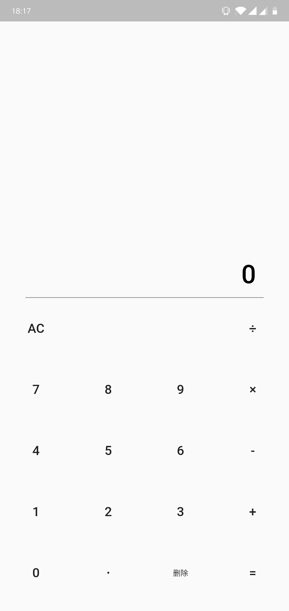
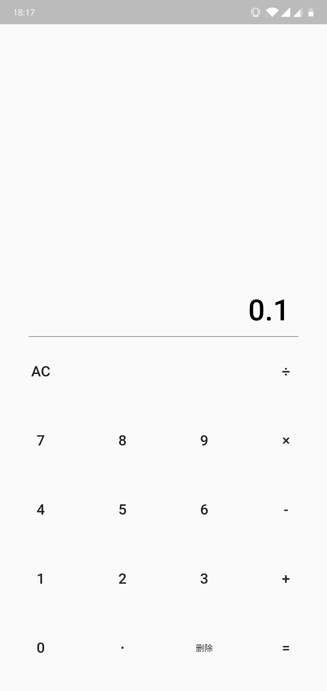
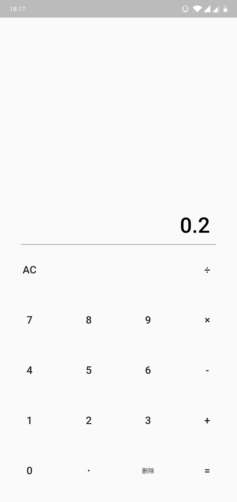

# 计算
一个用flutter开发精简版计算器

## 使用
1. 下载源码打包 `git clone https://github.io/mmtou/calculator`
2. [直接下载apk包](https://github.io/mmtou/calculator/docs/calculator.apk)

## 截图

## 遇到的问题
1. double精度问题，直接`0.1 + 0.2 != 0.3`，后来用第三方类库 [decimal](https://pub.dartlang.org/packages/decimal)